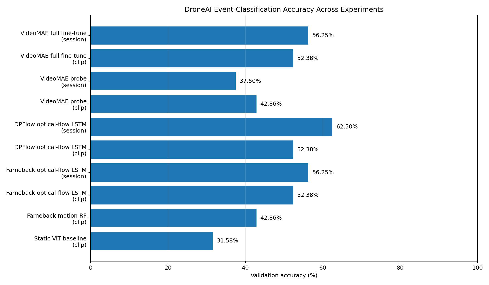
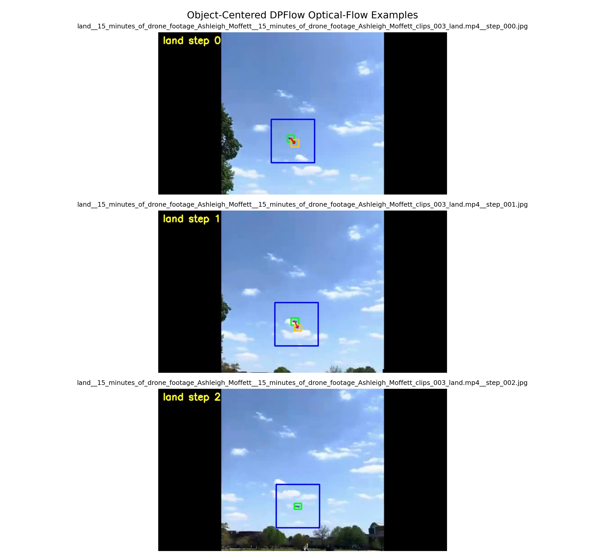
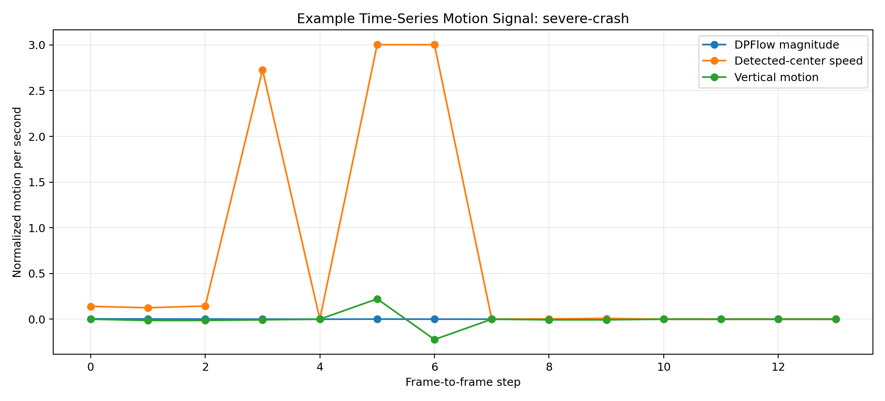
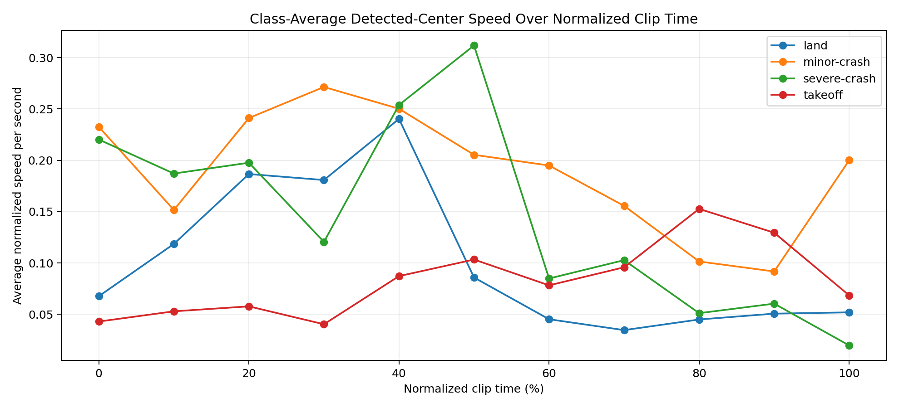

# DroneAI AI Experiments

This folder contains the current AI/ML experiments for the DroneAI project. The goal is to classify drone flight events from labeled video clips, including:

- takeoff
- land
- minor-crash
- severe-crash

The current research direction is focused on moving from static image classification toward motion-based video understanding.

---

## 1. Dataset Overview

The labeled clips were created using the DroneAI labeling GUI. Each clip is a short video segment corresponding to a drone event label. Frames were extracted from these clips and organized into a structured frame dataset.

Current clip count:

| Label | Clips |
|---|---:|
| land | 12 |
| minor-crash | 25 |
| severe-crash | 24 |
| takeoff | 22 |
| **Total** | **83** |

The dataset is still small and imbalanced, especially for the landing class.

---

## 2. ViT Baseline

The first baseline used a pretrained Vision Transformer model on extracted video frames.

Pipeline:

```text
clip -> extracted frames -> ViT frame classification -> averaged clip prediction
```

## DroneAI Progress Visualizations

This section tracks the current experimental progress for DroneAI. The goal is not just to report the best number, but to keep a clear record of what was tried, what improved, and what still needs work. This is important for the final paper because some experiments were useful even when they did not produce the highest accuracy.

At this stage, the project has moved from static image classification toward motion-based video understanding. The main finding so far is that drone events are difficult to classify from single frames alone. Takeoff, landing, and crash events depend on how the drone moves over time, so the most useful features are speed, direction, acceleration, optical flow, and temporal patterns across the clip.

### Accuracy Table

The table below keeps the main model results in one place. The best result so far is the DPFlow optical-flow LSTM on the session split. The dataset is still small, so these results should be treated as progress indicators rather than final benchmark numbers.

| Method | Split | Accuracy | Macro F1 | Weighted F1 | Notes |
|---|---:|---:|---:|---:|---|
| Static ViT baseline | clip | 31.58% |  |  | Static-frame baseline. Weak because the events are motion-based. |
| Farneback motion RF | clip | 42.86% |  |  | Classical motion features with Random Forest. |
| Farneback optical-flow LSTM | clip | 52.38% |  |  | Previous optical-flow sequence baseline. |
| Farneback optical-flow LSTM | session | 56.25% |  |  | Previous optical-flow sequence baseline. |
| DPFlow optical-flow LSTM | clip | 52.38% | 52.38% | 52.72% | Newer optical-flow method with fixed drone ROI matching. |
| **DPFlow optical-flow LSTM** | **session** | **62.50%** | **54.19%** | **60.73%** | **Current best result.** |
| VideoMAE probe | clip | 42.86% | 35.38% | 40.43% | Frozen pretrained VideoMAE backbone; trained only the classification head. |
| VideoMAE probe | session | 37.50% | 35.00% | 35.63% | Frozen pretrained VideoMAE backbone. |
| VideoMAE full fine-tune | clip | 52.38% | 51.50% | 51.71% | Full VideoMAE fine-tuning improved over the frozen probe. |
| VideoMAE full fine-tune | session | 56.25% | 53.33% | 57.08% | Full VideoMAE fine-tuning, but still below DPFlow-LSTM. |



### Object-Centered Optical Flow Visualization

The optical-flow pipeline uses the drone detector to focus motion estimation around the drone instead of treating the entire frame equally. This matters because the camera, floor, background, and lighting can introduce motion noise. The debug images below are included to make the method easier to inspect visually.

In the DPFlow extraction run, the drone ROI was available for about **89.47%** of frame-to-frame motion steps, and both consecutive frames had detections for about **78.19%** of steps. This shows that the detector and optical-flow pipeline are connected correctly after fixing the earlier path-matching issue.



### Time-Series Motion Data

Each labeled clip is treated as a short motion sequence, not as a group of unrelated frames. The time-series plots show how motion features change across the clip. This is important because the difference between takeoff, landing, minor crash, and severe crash often appears in the motion pattern over time.

The current time-series features include optical-flow magnitude, detected-center speed, vertical motion, and acceleration-style changes. These features are used by the LSTM classifier to learn event-level motion patterns.





### Current Interpretation

The results show that stronger optical flow helps, but optical flow alone is not enough to fully solve the task with only 83 clips. DPFlow produced the best current result, but the model is still limited by dataset size and class imbalance, especially for landing clips. The next major step is to expand the labeled dataset and continue testing models that combine visual video features with motion-based features.
