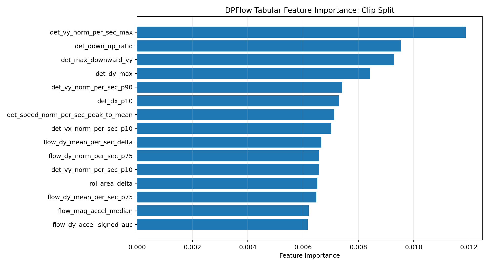
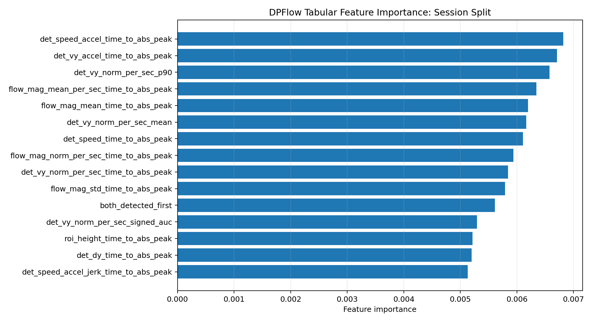

# DroneAI AI Experiments

This folder contains the current AI/ML experiments for the DroneAI project. The goal is to classify drone flight events from labeled video clips, including:

- takeoff
- land
- minor-crash
- severe-crash

The current research direction is focused on moving from static image classification toward motion-based video understanding.

---

## 1. Dataset Overview

The labeled clips were created using the DroneAI labeling GUI. Each clip is a short video segment corresponding to a drone event label. Frames were extracted from these clips and organized into a structured frame dataset.

Current clip count:

| Label | Clips |
|---|---:|
| land | 12 |
| minor-crash | 25 |
| severe-crash | 24 |
| takeoff | 22 |
| **Total** | **83** |

The dataset is still small and imbalanced, especially for the landing class.

---

## 2. ViT Baseline

The first baseline used a pretrained Vision Transformer model on extracted video frames.

Pipeline:

```text
clip -> extracted frames -> ViT frame classification -> averaged clip prediction
```

## DroneAI Progress Visualizations

This section tracks the current experimental progress for DroneAI. The goal is not only to show the best number, but also to show what was tried, what improved, and what still needs work.

The main direction of the project has shifted from static image classification toward motion-based video understanding. This is because takeoff, landing, and crash events are not single-frame events. They depend on how the drone moves across time.

### Accuracy Table

The newest experiment is the **DPFlow tabular baseline**. Instead of giving the LSTM the raw motion sequence, this approach summarizes each clip into physical motion statistics such as peak speed, average speed, vertical motion, acceleration-style changes, motion variation, and optical-flow energy.

This is useful because the current dataset is still small. Tree-based tabular models can sometimes work better than LSTMs when there are not many clips.

| Method | Split | Accuracy | Macro F1 | Weighted F1 | Notes |
|---|---:|---:|---:|---:|---|
| Static ViT baseline | clip | 31.58% | — | — | Static-frame baseline. Weak because events are motion-based. |
| Farneback motion RF | clip | 42.86% | — | — | Classical motion features with Random Forest. |
| Farneback optical-flow LSTM | clip | 52.38% | — | — | Previous optical-flow sequence baseline. |
| Farneback optical-flow LSTM | session | 56.25% | — | — | Previous optical-flow sequence baseline. |
| **DPFlow optical-flow LSTM** | **clip** | **52.38%** | **52.38%** | **52.72%** | LSTM trained on corrected DPFlow motion sequence features. |
| **DPFlow optical-flow LSTM** | **session** | **62.50%** | **54.19%** | **60.73%** | Previous best accuracy result. |
| VideoMAE probe | clip | 42.86% | 35.38% | 40.43% | Frozen pretrained VideoMAE backbone; trained only classification head. |
| VideoMAE probe | session | 37.50% | 35.00% | 35.63% | Frozen pretrained VideoMAE backbone. |
| VideoMAE full fine-tune | clip | 52.38% | 51.50% | 51.71% | Full VideoMAE fine-tuning improved over the frozen probe. |
| VideoMAE full fine-tune | session | 56.25% | 53.33% | 57.08% | Full VideoMAE fine-tuning, but below DPFlow-LSTM. |
| **DPFlow tabular Random Forest** | **clip** | **57.14%** | **55.95%** | **56.80%** | Feature-engineered DPFlow summary statistics with a tree-based tabular model. |
| **DPFlow tabular Extra Trees** | **session** | **62.50%** | **60.00%** | **63.12%** | Feature-engineered DPFlow summary statistics with a tree-based tabular model. |


### New Result: DPFlow Tabular Features

The DPFlow tabular model improved the clip split result from **52.38%** with DPFlow-LSTM to **57.14%** with Random Forest.

On the session split, the tabular model matched the DPFlow-LSTM accuracy at **62.50%**, but improved the F1 scores:

| Split | Previous DPFlow-LSTM | New DPFlow tabular model | Interpretation |
|---|---:|---:|---|
| Clip accuracy | 52.38% | **57.14%** | Tabular motion features improved the clip split. |
| Session accuracy | 62.50% | **62.50%** | Accuracy tied the previous best. |
| Session macro F1 | 54.19% | **60.00%** | Better class balance than the LSTM. |
| Session weighted F1 | 60.73% | **63.13%** | Better overall F1 than the LSTM. |

This supports the idea that with only 83 clips, feature-engineered motion statistics may be more reliable than raw sequence learning.

### Feature Importance

The feature-importance plots help show which motion statistics the tree-based models used most. This is useful for the research paper because it makes the model easier to explain compared to a black-box LSTM.





### Object-Centered Optical Flow Visualization

The optical-flow pipeline uses the drone detector to focus motion estimation around the drone instead of treating the entire frame equally. This matters because the camera, floor, background, and lighting can introduce motion noise.

In the corrected DPFlow extraction run, the drone ROI was available for about **89.47%** of frame-to-frame motion steps, and both consecutive frames had detections for about **78.19%** of steps.


### Time-Series Motion Data

Each labeled clip is treated as a short motion sequence. The time-series plots show how motion features change across the clip. This is important because the difference between takeoff, landing, minor crash, and severe crash often appears in the motion pattern over time.


### Current Interpretation

The best current accuracy is still **62.50%**, but the new DPFlow tabular result is important because it matched the best LSTM accuracy while improving F1. It also gives feature importance, which helps explain what physical motion signals are actually useful.

The main limitation is still dataset size. The current dataset has only 83 clips, and the landing class is especially small. The next major step is to expand the labeled dataset and continue testing models that combine motion features with visual video features.
